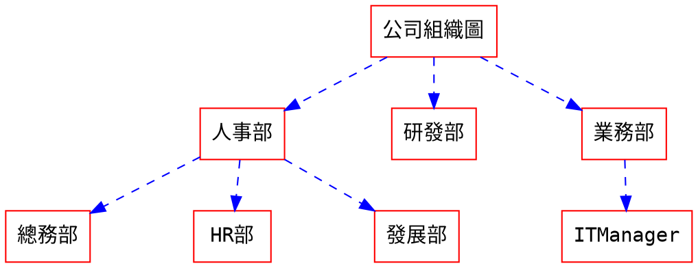
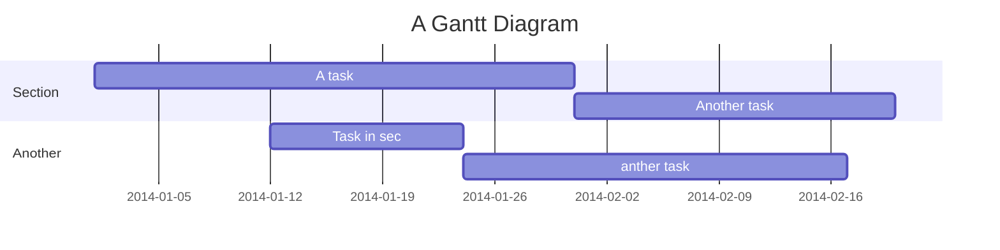





info 提示塊標籤


# HackMD/markdown筆記

## MarkDown語法

### ==標題==

```sass
# H1  或 下方=== 三個等號
## H2
### H3
#### H4
##### H5
###### H6
```

### ==引用==

```sass
>
```

> conment 引言  加上[]   可以插入名稱、日期、連接 例如 [name=Nick liu] [time=Sun, Nov 27, 2022 2:35 PM] [color=#51d177] [從無到有學習HackMD](https://www.youtube.com/watch?v=r5FOR-YU33c "從無到有學習HackMD")
>> [color=#5ed5e5][TOC]

### ==列表清單==

```純文字
-
+
*  
減號 加號 星號 加一個空格 都是列表 縮排 加上空二格 子列表
```

- 列表方式
- 列表的用法
- 列表的運行
- 列表的顯示

* 星號也可當列表
* 星號也一樣哦

+ 加號也是列表
+ 會用了吧
  + 縮排的用法
    + 這也是縮排嗎
    + 多層項次
      + 試看
        + 隔二空格
        - 減號也試
      + 如何 

### ==數列==

```
1.
需數字開頭 數字 + 反斜線 + .   ex.2019\.
數字的號碼 無關順序
```

1. 123
2. 456
3. 789
    1. 123
    5. 123
    6. 345
5. 567
6. 

### ==check list 待辦清單==

```markdown
- [x] 工作事項1
- [ ] 工作事項2
- [ ] 工作事項3
```

- [x] 工作事項1
- [ ] 工作事項2
- [ ] 工作事項3

### ==區塊程式碼==

方法一:
    1.前面直接加四個空白 或 Tab   為單行程式碼(上下要留空行)

方法二:
    2.三個上下反引號   ```+ 語言   .=行碼  +編號開始 !折行
    
```php=56!
for (let i = 0; i < 10; i++) {
  setTimeout(function () {
    console.log('這執行第' + i + '次');
  }, 0);
```

補充: 後面加上語法名稱

```html
javascript 或是寫 js
html
css
scss
sass
json
php
python
java
```

如果你想知道你目前想寫的程式碼是否有支援高亮，你可以透過[這裡](https://highlightjs.org/static/demo/)查詢。

### ==行內程式碼  Ctrl+E==

```text
想要特別顯示`<strong>`的用法  
```

想要特別顯示 `<strong>` 的用法

### ==分隔線==

```text
---
___
*** 這都是
```

### ==斜體 Ctrl+I==

```text
*斜體*
```

*斜體*

### ==粗體 Ctrl+B==

```text
**粗體**
```

**粗體**

### ==粗體+斜線==

```text
    ***粗體+斜線***
```

***粗體+斜線***

### ==底線文字==

```text
    ++這是底線文字++
```    

++這是底線文字++

### ==旁註標記==

```text
  {旁註標記|測試}
```

{旁註標記|測試}

### ==重點==

```text
==重點標示==
```

文字中要顯示重點可以前後加上等於二個==重點標示==

### ==警示區塊==

```
:::success
耶 :tada:
:::
```

:::success
耶 :tada:
:::

---

```
:::info
這是訊息 :mega:
:::
```

:::info
這是訊息 :mega:
:::

---

```
:::warning
注意 :zap:
:::
```

:::warning
注意 :zap:
:::

---

```
:::danger
喔不 :fire:
:::
```

:::danger
喔不 :fire:
:::

---

```
:::spoiler 點選顯示更多內容
找到我了！ :stuck_out_tongue_winking_eye:
:::
```

:::spoiler 點選顯示更多內容
找到我了！ :stuck_out_tongue_winking_eye:
:::

---

```
:::spoiler {state="open"} 預設展開摺疊內容
找到我了！ :stuck_out_tongue_winking_eye:
:::
```

:::spoiler {state="open"} 預設展開摺疊內容
找到我了！ :stuck_out_tongue_winking_eye:
:::

---

### ==刪除線==

```
    ~~刪除線用法~~
```

~~刪除線用法~~

### ==上標==

```
    文字的上標<sup>用法 </sup>
    ^2^
```

文字的上標<sup>用法 </sup>
12345^2^

### ==下標==

```
    文字的下標<sub>用法 </sub>
    ~2~
```
文字的下標<sub>用法 </sub>
文字的~下標用法~

### ==連結==

**基本用法:**
[] 說明
() 連結

```
[Google](https://www.google.com.tw/)
```

[Google](https://www.google.com.tw/)

**進階用法:**

這裡要說明進階用法 連接 [Google][] 另外設立連結標籤 [相片][]

[google]: http://google.com/ "Google"
[相片]: http://search.yahoo.com/ "Yahoo Search"

```text
這裡要說明進階用法 連接 [Google][] 另外設立連結標籤 [相片][]

[google]: http://google.com/        "Google"
[相片]: http://search.yahoo.com/  "Yahoo Search"
```

### ==圖片==

**基本用法1:**
![ ]：括號的內容也並非必填，提示文字。
( )：圖片連結位置
=200x: 調整圖片尺寸 設定為寬度
範例:

     

**進階用法:**

如同連結一般，圖片也可以用註腳語法
![Alt text][id]
使用參考，可以在稍後的文件中再定義圖片網址

[id]: https://picsum.photos/600/100?random=10


萬用圖片路徑(一直變動)

    https://picsum.photos/300/200?random=10


方法一：嵌入HTML代码
使用img标签
```
 
 ```

如果需要居中的话只要在外面包围div标签即可
```
<div  align="center">    
...
</div>
```

方法二：使用支持图片大小更改操作的 Mou 编辑器

使用如下语法
```

```


直接在图片后面加上对应的CSS样式即可
```
{:class="img-responsive"}
{:height="50%" width="50%"}
{:height="100px" width="400px"}
```
## UML 圖表

### ==循序圖==
> 更多關於 **循序圖** 語法 [在這裡](http://bramp.github.io/js-sequence-diagrams/).

您可以像是以下使用循序圖：

```sequence
艾莉絲->包柏: 哈摟，你好嗎？
Note right of 包柏: 包柏思考中
包柏-->艾莉絲: 我很好，謝謝！
Note left of 艾莉絲: 艾莉絲回應
艾莉絲->包柏: 最近過得怎樣？
```

### ==流程圖==
> 更多關於 **流程圖** 語法 [在這裡](http://adrai.github.io/flowchart.js/).

```flow
st=>start: 開始
e=>end: 結束
op=>operation: 我的操作
op2=>operation: 啦啦啦
cond=>condition: 是或否？

st->op->op2->cond
cond(yes)->e
cond(no)->op2
```


```flow
st=>start: 開始|past:>http://www.google.com[blank]
e=>end: 結束|future:>http://www.google.com
op1=>operation: 我的操作|過去
op2=>operation: 內容|當前
sub1=>subroutine: 子程序|invalid
cond=>condition: 是
or 否?|已批准:>http://www.google.com
c2=>condition: 好主意|rejected
io=>inputoutput: 抓著一些東西...|future

st->op1(right)->cond
cond(yes, right)->c2
cond(no)->sub1(left)->op1
c2(yes)->io->e
c2(no)->op2->e
```


### ==組織圖==
> 更多關於 **組織圖** 語法 [在這裡](http://www.tonyballantyne.com/graphs.html)



### ==甘特圖==
> 更多關於 **甘特圖** 語法 [在這裡](http://mermaid-js.github.io/mermaid)



> 更多關於 **abc** 語法 [在這裡](http://abcnotation.com/learn)
> 更多關於 **vega** 語法 [在這裡](https://vega.github.io/vega-lite/docs)

### ==小圖示運用==
> 完整的表情符號列表 [在這裡](https://github.com/ikatyang/emoji-cheat-sheet)
常用的符號
[箭頭符號](https://github.com/ikatyang/emoji-cheat-sheet#arrow)
[計算機](https://github.com/ikatyang/emoji-cheat-sheet#computer)
:arrow_right: `:arrow_right:`
:arrow_left: `:arrow_left:`
:tada: `:tada:`
:bulb: `:bulb:`
:book: `:book:`
:hourglass: `:hourglass:`


<i class="fa fa-file-text"></i> **文件** `<i class="fa fa-file-text"></i>`
<i class="fa fa-pencil fa-fw"></i> **編輯** `<i class="fa fa-pencil fa-fw"></i>`
<i class="fa fa-eye fa-fw"></i> **看** `<i class="fa fa-eye fa-fw"></i>`
<i class="fa fa-columns fa-fw"></i> **二欄分頁** `<i class="fa fa-columns fa-fw"></i>`
<i class="fa fa-camera"></i> **相機** `<i class="fa fa-camera"></i>`
<i class="fa fa-share-alt"></i> **分享** `<i class="fa fa-share-alt"></i>`
<i class="fa fa-dropbox"></i> **dropbox** `<i class="fa fa-dropbox"></i>`
<i class="fa fa-github"></i> **github** `<i class="fa fa-github"></i>`
<i class="fa fa-clipboard"></i> **剪貼簿** `<i class="fa fa-clipboard"></i>`
<i class="fa fa-toggle-on"></i> **開關** `<i class="fa fa-toggle-on"></i>`
<i class="fa fa-tv"></i> **簡報模式** `<i class="fa fa-tv"></i>`
<i class="fa fa-book"></i> **書籍模式** `<i class="fa fa-book"></i>`
<i class="fa fa-bars"></i> **小按鈕** `<i class="fa fa-bars"></i>`
<i class="octicon octicon-link"></i> **錨點** `<i class="octicon octicon-link"></i>`
